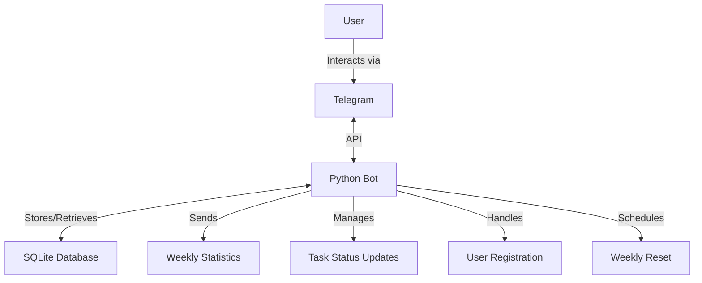
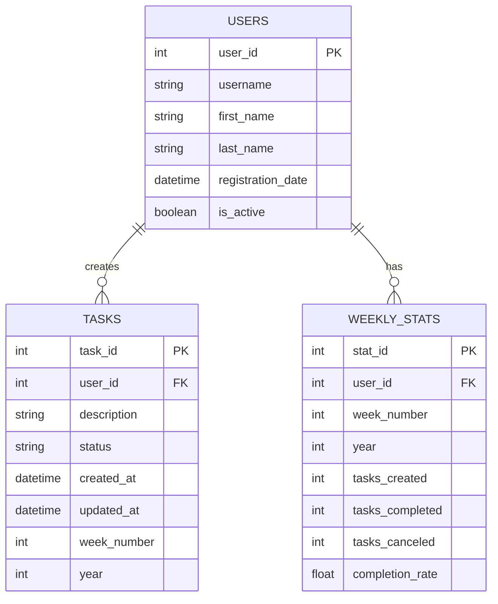
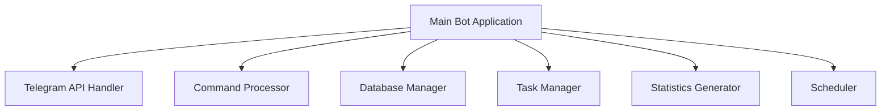
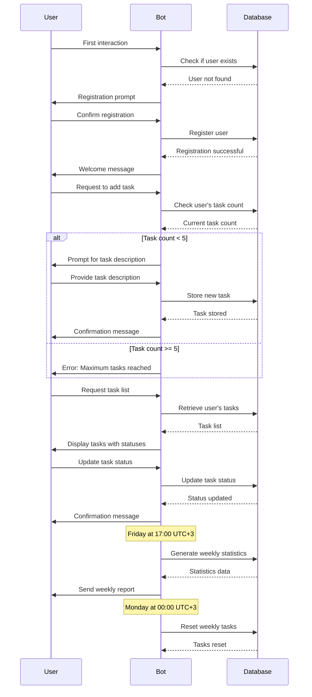
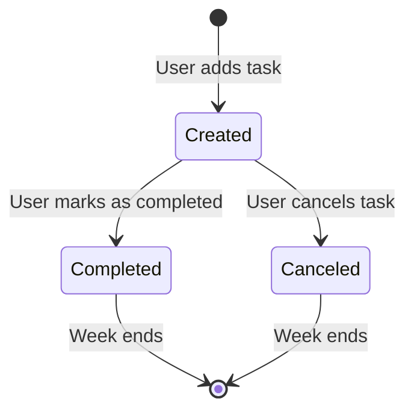

# Python Telegram Task Management Bot - Design Plan

## 1. System Overview

The bot will be a Telegram-based task management system that allows users to register, create 3-5 tasks per week, track task statuses, and receive weekly statistics.



## 2. Database Schema

We'll use SQLite for data storage with the following schema:



## 3. Core Components

### 3.1. Bot Framework



### 3.2. Component Responsibilities

1. **Main Bot Application**
   - Initialize and configure the bot
   - Connect to Telegram API
   - Set up command handlers
   - Manage the application lifecycle

2. **Telegram API Handler**
   - Process incoming messages
   - Send responses to users
   - Handle Telegram-specific functionality

3. **Command Processor**
   - Parse user commands
   - Route commands to appropriate handlers
   - Validate user input

4. **Database Manager**
   - Handle database connections
   - Perform CRUD operations
   - Manage data integrity

5. **Task Manager**
   - Create, update, and delete tasks
   - Validate task constraints (3-5 tasks per week)
   - Track task statuses

6. **Statistics Generator**
   - Calculate weekly statistics
   - Generate reports for users
   - Store historical data

7. **Scheduler**
   - Manage weekly resets (every Monday)
   - Trigger weekly statistics at 17:00 UTC+3 on Fridays
   - Handle time-based events

## 4. User Interaction Flow



## 5. Bot Commands

| Command | Description |
|---------|-------------|
| `/start` | Initiates interaction with the bot, triggers registration for new users |
| `/help` | Displays available commands and their descriptions |
| `/add_task` | Starts the process of adding a new task |
| `/my_tasks` | Lists all tasks for the current week with their statuses |
| `/update_task` | Starts the process of updating a task's status |
| `/stats` | Shows the user's statistics for the current week |
| `/history` | Shows the user's historical weekly statistics |

## 6. Task Status Workflow



## 7. Implementation Plan

### 7.1. Project Structure

```
telegram-task-bot/
├── bot.py                 # Main bot application
├── config.py              # Configuration settings
├── database/
│   ├── __init__.py
│   ├── manager.py         # Database connection and operations
│   └── models.py          # Database models
├── handlers/
│   ├── __init__.py
│   ├── command_handler.py # Command processing
│   ├── message_handler.py # Message processing
│   └── callback_handler.py # Callback query processing
├── services/
│   ├── __init__.py
│   ├── task_service.py    # Task management logic
│   ├── user_service.py    # User management logic
│   └── stats_service.py   # Statistics generation
├── utils/
│   ├── __init__.py
│   ├── scheduler.py       # Scheduling functionality
│   └── helpers.py         # Helper functions
├── requirements.txt       # Project dependencies
└── README.md              # Project documentation
```

### 7.2. Technology Stack

- **Python 3.8+**: Core programming language
- **python-telegram-bot**: Library for Telegram Bot API integration
- **SQLite**: Database for storing user and task data
- **APScheduler**: For scheduling weekly resets and statistics generation
- **Logging**: For application monitoring and debugging

### 7.3. Implementation Phases

1. **Phase 1: Setup and Basic Structure**
   - Set up project structure
   - Configure Telegram bot
   - Implement database schema
   - Create basic command handlers

2. **Phase 2: Core Functionality**
   - Implement user registration
   - Implement task management (add, view, update)
   - Implement task status validation
   - Create basic user interface

3. **Phase 3: Scheduling and Statistics**
   - Implement weekly task reset
   - Implement statistics generation
   - Create weekly report formatting
   - Set up scheduled jobs

4. **Phase 4: Testing and Refinement**
   - Test all functionality
   - Refine user experience
   - Handle edge cases
   - Optimize performance

5. **Phase 5: Deployment**
   - Prepare for deployment
   - Set up monitoring
   - Create documentation
   - Deploy the bot

## 8. Security Considerations

- Store Telegram API tokens securely
- Validate all user input
- Implement proper error handling
- Ensure database security
- Regularly backup user data

## 9. Future Enhancements

- Multi-language support
- Task categories/tags
- Task priority levels
- Reminders for incomplete tasks
- Integration with other productivity tools
- Data visualization for statistics